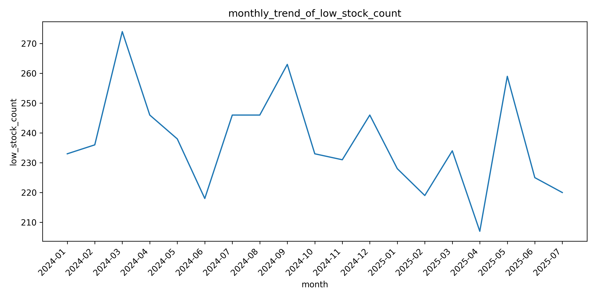
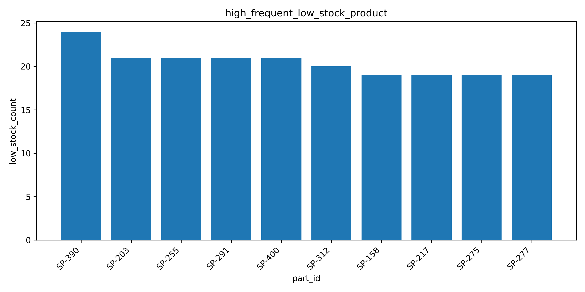
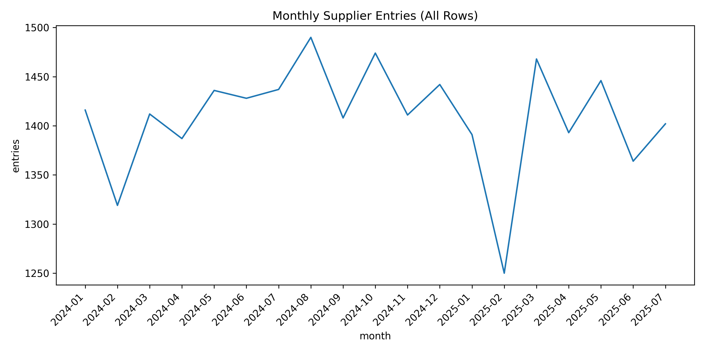
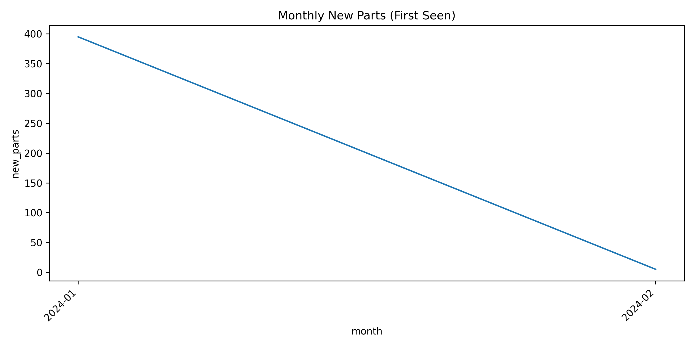
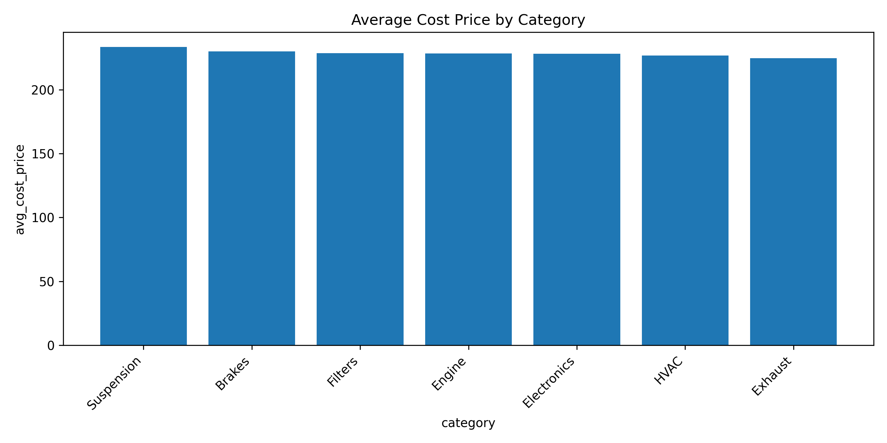
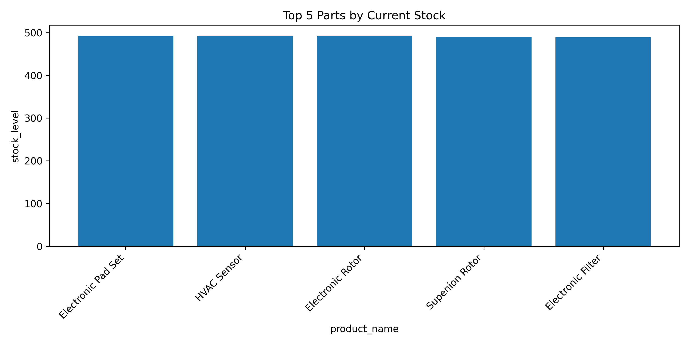

# Project: Supplier Data Integration & Analysis Pipeline

## Objective
Parts Avatar is looking to integrate a new auto parts supplier to expand our inventory. We have received a sample data feed (`supplier_feed.csv`) containing their product stock levels and costs, along with a separate file (`product_metadata.csv`) that maps supplier part IDs to our internal product information.

Our goal is to build a reliable, automated pipeline to process this data, load it into a database, and perform an initial analysis to determine the viability of this supplier.

## The Challenge
The supplier's data feed is notoriously unreliable. It contains inconsistencies, missing values, and mixed data types that must be handled gracefully. Your task is to design and implement a small-scale ETL (Extract, Transform, Load) pipeline that is robust enough to handle these issues and produce clean, analytics-ready data.

## Datasets
* `data/supplier_feed.csv`: The raw, messy data from the new supplier.
* `data/product_metadata.csv`: Maps the supplier's parts to our internal system.

## Your Tasks
1.  **Extract & Transform:**
    * Write a Python script (`src/transform_data.py`) to read, clean, and standardize the `supplier_feed.csv` data.
    * **Problem-Solving:** You must make and document key decisions. For example: How do you handle "Low Stock"? How do you impute missing `cost_price` values? What is your strategy for standardizing the messy `entry_date` column? Justify your choices in this README.

2.  **Load:**
    * Create a simple SQLite database (`parts_avatar.db`).
    * Load the cleaned supplier data and the product metadata into two separate tables in the database. Ensure the data types are correct and consider setting up primary keys.

3.  **Analyze & Visualize:**
    * Write a Python script or a Jupyter Notebook to query the SQLite database and answer the following business questions:
        * What is the average cost price per product category?
        * Which top 5 parts have the highest stock levels right now?
        * How has the number of new parts entries from this supplier changed over time (on a monthly basis)?
    * Create at least two clear and informative visualizations (e.g., using Matplotlib, Seaborn, or Plotly) to present your findings.

4.  **Documentation:**
    * Update this `README.md` file to be a comprehensive report of your project.
    * Explain your data cleaning strategies and justify your decisions.
    * Describe the schema of your database tables.
    * Present your findings from the analysis, including the visualizations you created.
    * Provide clear instructions on how to run your entire pipeline from start to finish.

## Evaluation Criteria
* **Problem-Solving:** The logic and justification behind your data cleaning and transformation decisions.
* **Python & SQL Proficiency:** The quality, efficiency, and organization of your code.
* **Data Engineering Concepts:** The structure and robustness of your ETL pipeline.
* **Data Visualization & Communication:** The clarity and impact of your analysis and visualizations in the README report.

## Disclaimer: Data and Evaluation Criteria
Please be advised that the datasets utilized in this project are synthetically generated and intended for illustrative purposes only. Furthermore, they have been significantly reduced in terms of sample size and the number of features to streamline the exercise. They do not represent or correspond to any actual business data. The primary objective of this evaluation is to assess the problem-solving methodology and the strategic approach employed, not necessarily the best possible tailored solution for the data. 


## 5. Setup Instructions

### 5.1 Prerequisites
- **Python** ≥ 3.10  
- **sqlite3** CLI (preinstalled on macOS/Linux)

**Required Python libraries:**

```bash
pip install pandas matplotlib seaborn
```

---

### 5.2 Database Schema
Schema file: `src/parts_avatar_schema.sql`

---

## 6. How to Run the Pipeline

### Step 1: Create the database tables

```bash
sqlite3 src/parts_avatar.db < src/parts_avatar_schema.sql
```

### Step 2: Transform raw supplier data

```bash
python src/transform_data.py
```

This script will:
- Clean inconsistent values  
- Standardize dates to `YYYY-MM-DD`  
- Save cleaned data as `data/supplier_feed_clean.csv`

### Step 3: Load data into SQLite

```bash
python src/load_data.py
```

This will insert both `supplier_feed_clean.csv` and `product_metadata.csv` into the database.


### Step 4: Run analysis queries and generate plots

```bash
python src/analysis.py
```

This script will:
- Connect to `parts_avatar.db`  
- Run the analysis queries (top 5 low stock products, monthly trends, etc.)  
- Generate plots and save them into the `analysis/analysis_outputs` folder

---

## Running the Pipeline with Make

For convenience, you can run the entire ETL + analysis pipeline using the `Makefile`:

```bash
make
```

Or run individual steps:

```bash
make transform   # Clean and standardize supplier CSV  
make schema      # Create database schema  
make load        # Load cleaned data into SQLite  
make analyze     # Run analysis and generate charts  
make reset       # Reset database (drop & recreate)  
make clean       # Remove database and outputs  
```

---

## 8. ETL Pipeline

### 8.2 Extract Step 

In this project, I get the raw data from two CSV files:

- `supplier_feed.csv`: This file has the product stock levels and prices from the new supplier.
- `product_metadata.csv`: This file links supplier part IDs to our internal system.

I use **pandas** to read these CSV files into Python as dataframes.

For example:

```python
df = pd.read_csv("supplier_feed.csv")
```

After that, I start checking the data:
- I look at the first few rows (`df.head()`)
- I check the data types (`df.info()`)
- I count missing values (`df.isna().sum()`)

This part helps me understand what kind of problems I need to fix — like missing numbers, bad date formats, or strange text in numeric columns.


### 8.2 Transformation & Cleaning Step

#### Handling Missing Values (Strategy)

During data exploration, I found:

- About **13%** of `stock_level` values were missing or unusable  
- About **5%** of `cost_price` values were missing

So, I used this strategy:

- I changed "Out of Stock" and similar words to `0`  
- I replaced "Low Stock" with the **smallest positive value** in the column  
- I filled other missing stock levels with the **median** value  
- I **dropped rows** where `cost_price` was missing, because price is important and I didn’t want to guess it


After loading the raw data, I cleaned and transformed it to make it ready for analysis and loading into a database. Here's what I did:

---

#### 1. Cleaning `stock_level` Column

**Problem:**  
The `stock_level` column had many problems:
- Some values were text like "Out of Stock", "Low Stock", or "Unavailable"
- Some values were missing (NaN)
- Some values were not whole numbers

**Steps I took:**

1. **Found bad values**  
   I used `pd.to_numeric(..., errors='coerce')` to convert values to numbers and detect which ones were not valid.

2. **Visualized stock levels**  
   I made a histogram to see the distribution of numeric stock levels. I explored their distribution to evaluate suitable cleaning techniques, including the choice between mean and median imputation.

3. **Normalized text values**  
   I changed:
   - `"Out of Stock"`, `"Unavailable"` → `0`  
   - `"Low Stock"`, `"Low"` → a special value (see next step)

4. **Replaced "Low Stock" with smallest real value**  
   I checked all stock levels that were > 0 and used the **smallest positive value** as the replacement for "Low Stock".  
   I chose this approach to keep the process data-driven and aligned with the supplier’s reporting protocols.

5. **Filled missing values**  
   For the rest of missing stock values, I used the **median** of the column.  
   The median is good because it is not affected by outliers.

6. **Final conversion**  
   I made sure the `stock_level` column has only whole numbers by using `.round().astype(int)`.

---

#### 2. Cleaning `cost_price` Column

**Problem:**  
- Some rows had missing prices  
- Some prices had `$` symbols and were in string format

**Steps I took:**

1. **Dropped missing prices**  
   I removed rows where `cost_price` was missing.  
   Since prices are critical and vary widely across car parts, I removed the rows with missing prices.
   As they represent only about 5% of the data, this approach is safe and avoids unreliable imputation.

2. **Removed `$` signs**  
   I used `.str.replace("$", "")` to remove the dollar sign from prices.

3. **Converted to float**  
   I changed the column to float using `.astype(float)`

Now the `cost_price` column is clean and ready to use.

---

#### 3. Cleaning `entry_date` Column

**Problem:**  
- Many date formats were used (like `"Apr 12, 2025"` or `"04/12/25"`)  
- Some values were empty, unparseable, or had wrong years (e.g., 1980)

**Steps I took:**

1. **Created a parser function**  
   I wrote a function `parse_entry_date` to handle different formats.  
   It uses `pd.to_datetime()` and also handles U.S.-style dates manually.

2. **Normalized the dates**  
   I removed the time part and kept only the date.

3. **Removed bad dates**  
   I marked all dates before `2000-01-01` or after today as missing (NaT).

4. **Audit**  
   I printed how many dates were:
   - Empty or like `"N/A"`, `"null"`, etc.
   - Could not be parsed
   - Out of range

Now `entry_date` is in a standard format (`YYYY-MM-DD`) and clean.

---

### Final Step

After all this, I saved the cleaned file to:

```bash
supplier-data-pipeline/data/supplier_feed_cleaned.csv
```

This cleaned file is now ready for loading into the database and for analysis.

### 8.3 Load (SQLite)

This step writes the cleaned data into the SQLite database.

**What happens:**
- The script connects to `parts_avatar.db` (created earlier when applying `schema.sql`).
- It loads **product metadata**:
  - If `data/product_metadata.csv` exists, it uses it.
  - If not, it creates minimal metadata from distinct `part_id`s in the cleaned feed.
  - Inserts with `INSERT OR IGNORE` (does not duplicate existing parts).
- It loads **supplier snapshots** into `supplier_data`:
  - Validates required columns: `part_id`, `stock_level`, `cost_price`, `entry_date`.
  - Enforces correct types (e.g., `stock_level` as integer, `entry_date` as `YYYY-MM-DD` text).
  - Inserts with `INSERT OR REPLACE` so the primary key `(part_id, entry_date)` stays unique (latest record replaces the older one).

**Run it:**
```bash
python src/load_to_sqlite.py
```

**Requirements / Notes:**
- Apply the schema first (tables and indexes):
  ```bash
  sqlite3 src/parts_avatar.db < schema.sql
  ```
- Make sure you have already produced `data/supplier_feed_cleaned.csv` in the **Transform** step.
- If you do not have a `data/product_metadata.csv`, the script will create minimal metadata from the cleaned feed (only `part_id` values, empty `part_name` and `category` to fill later).
- The database file path is set in the script:
  ```
  DB_PATH = ".../src/parts_avatar.db"
  ```
  Adjust if your paths are different.

**Why `INSERT OR IGNORE` and `INSERT OR REPLACE`?**
- `product_metadata`: we **ignore** duplicates so we don’t overwrite existing names/categories.
- `supplier_data`: we **replace** existing rows for the same `(part_id, entry_date)` to keep **one snapshot per day** and ensure the latest data wins.


## 9. Database Schema  

The database is organized into two tables:  

1. **`product_metadata`** – Stores stable reference data about each part (e.g., name, category).  
2. **`supplier_data`** – Stores daily supplier feed snapshots (stock levels, prices).  

### ERD (Entity Relationship Diagram)  


#### ASCII fallback
```
+---------------------+           has daily snapshots           +---------------------+
|   PRODUCT_METADATA  |----------------------------------------<|    SUPPLIER_DATA    |
+---------------------+                                         +---------------------+
| PK part_id : TEXT   |                                         | PK part_id : TEXT   |
| part_name : TEXT    |                                         | PK entry_date : TEXT|
| category : TEXT     |                                         | stock_level : INT   |
+---------------------+                                         | cost_price : REAL   |
                                                                | created_at : TEXT   |
                                                                +---------------------+
                                                                FK part_id -> PRODUCT_METADATA.part_id
                                                                entry_date format: 'YYYY-MM-DD'
```

### Legend  
- **PK** = Primary Key  
- **FK** = Foreign Key  
- `||--o{` = One-to-many relationship (a product can have many supplier snapshots).  

### Why this schema?  
- **Separation of concerns:** Stable product info (name, category) is kept in `product_metadata`, while variable daily measures (stock, cost) are stored in `supplier_data`.  
- **Historical tracking:** Composite key `(part_id, entry_date)` ensures one snapshot per part per day, enabling trend analysis (e.g., stock movements, cost changes).  
- **Data integrity:** The foreign key enforces that all supplier records must map to a valid product.  
- **Performance:** Indexes on `entry_date` and `category` speed up common queries such as time-based reports and category-level aggregations.  

---

## 10. Results & Visualizations

### 📈 1. Monthly Trend of Low Stock Products

I counted how many parts were marked as **low stock** each month. This shows how the supplier’s inventory changed over time.

- There were **peaks** in March 2024 and September 2024, where more products were low in stock.
- The **lowest point** was in April 2025.

This kind of analysis helps understand if the supplier has stable inventory or if stock levels change too much.




### 📦 2. Most Frequently Low Stock Products

This bar chart shows the **top 10 parts** that were most often in **low stock** condition.

- The part **SP-390** had low stock **24 times** — more than any other.
- Other frequent ones include **SP-203**, **SP-255**, and **SP-291**.

Knowing which parts are often low in stock helps the business:
- Reorder them earlier
- Ask the supplier for better stock management



---

### 📈 3. Monthly New Part Entries

This chart shows how many **new parts** were added by the supplier each month.

- It gives a good view of whether the supplier is adding new products regularly.
- From the chart, we can see that the number of entries stays quite stable, with small ups and downs.
- A big **drop in February 2025** might be an error or seasonal pause.

This helps check if the supplier is active and consistent.




### 📈 4. Monthly New Parts (First Seen)

This chart shows how many **new unique parts** were added for the first time each month.

- The chart shows a clear **drop** from January 2024 to February 2024.
- In January, almost 400 new parts appeared for the first time.
- In February, this number fell to almost zero and then stops.

This could mean:
- This could mean that the supplier added many new parts at the beginning, but after that, they mainly updated prices without introducing new products.




---

### 💰 5. Average Cost Price by Category

This bar chart shows the **average cost price** for each product category.

- All categories have **similar average prices**, around \$225–\$235.
- The **Suspension** category has the highest average price.
- The **Exhaust** category is slightly lower than the others.

This helps us understand the price ranges across different product categories. Personally, I expected to see bigger differences, but it still shows that each category includes items with a range of prices, giving customers more choices based on their budget.



---

### 🏷️ 6. Top 5 Parts by Current Stock

This chart shows the five parts with the **highest stock levels** in the database.

- All five parts have almost **equal stock**, around 490 units.
- The top stocked item is **Electronic Pad Set**, followed by HVAC and Rotor items.

This analysis helps us understand the physical limitations of the supplier and also gives us ideas for which items could be used in future promotions.

